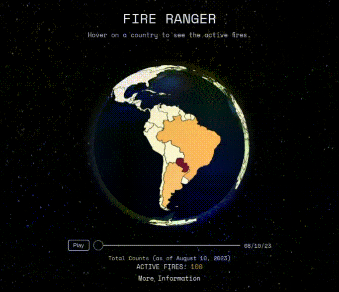

# FIRE RANGER

A 3D visualization of active fires across the world, using data from [NASA's FIRMS](https://firms.modaps.eosdis.nasa.gov/space-apps-2023)



## 🛠 Installing

1. Install dependencies

   ```bash
   yarn install
   ```

2. Fire up the server and watch files

   ```bash
   yarn run dev
   ```

## 📝 License & copyright

3D world 
© Robert C Soriano

Licensed under the [GNU General Public License](LICENSE.md).

